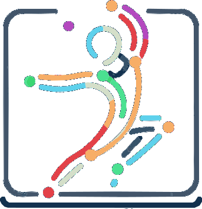

# Mime Flow 🕺💃

<p align="center">
  
</p>

Welcome to **Mime Flow**! This alpha version of our versatile pose matching application lets you engage interactively to practice and perfect your poses across various disciplines, from dance to martial arts, and yoga. 

With our latest update, Mime Flow has transformed from a simple analysis tool into a fully **Modern Gamified Experience** inspired by premium fitness ecosystems like Apple Fitness+.

### How to Play:

1. **Start at the Homepage:** Paste a YouTube URL to begin or upload a local video.
2. **Setup Screen Share:** You'll be redirected to the tracking page. Click "Start Game & Share Screen" and select the **current tab** in the browser popup (if using YouTube).
3. **Trigger the Flow State:** As you mimic the poses, the system tracks your accuracy in real-time. Hit consistent perfect poses to build your **Momentum Burn Bar** and trigger a dazzling **Flow State** color shift.
4. **Analytics Dashboard:** After the video ends, you'll be presented with a premium Post-Game Analytics Dashboard dissecting your limb precision, peak accuracy, and maximum streak.

---

### Key Gamification Features:

- **Apple Fitness+ Aesthetics:** A polished, modern UI using glassmorphism, smooth gradients, and clean typography.
- **Dynamic Flow State:** A visual momentum tracker that responds instantly strictly based on your rhythmic accuracy, providing satisfying visual feedback without distracting from the actual gameplay.
- **Granular Limb Analytics:** Post-game breakdowns allow you to see exactly which limbs need improvement, encouraging replayability and mastery.

---

### Revolutionary Pose Similarity Calculation

We recently completely overhauled the core mathematical engine driving Mime Flow. Our new calculation method uses strict, scale-invariant 3D features:

- **Unit Bone Vectors:** Instead of attempting to calculate arbitrary pixel distances or skewed angles, the system computes the highly-accurate 3D directional vectors (X,Y,Z in meters natively from MediaPipe `worldLandmarks`) of every human bone and normalizes their length to 1. 
- **Scale and Position Invariance:** Because we rely purely on Biological Unit Vectors, you can stand as close or as far away from the camera as you want. The algorithm evaluates your *posture*, not your physical placement on screen.
- **Temporal Double Buffering (DTW-lite):** We evaluate your frames against a sliding window of the target video, functioning similarly to Dynamic Time Warping. This compensates seamlessly for tiny human timing errors (dancing slightly ahead or behind the beat).
- **Human-Centric Joint Weighting:** We heavily penalize errors in the extremities (hands and feet carry a `2.0x` score weight) while suppressing the natural noise and jitter of facial landmarks. 

---

### Getting Started:

Set up Mime Flow on your local system with these simple steps:

1. **Clone the repository:**
   ```bash
   git clone https://github.com/lguibr/Mimeflow.git
   ```
2. **Navigate to the project directory:**
   ```bash
   cd Mimeflow
   ```
3. **Install dependencies:**
   ```bash
   npm install
   ```
4. **Launch the development server:**
   ```bash
   npm run dev
   ```

### Technologies Used:

- **Frontend:** React, Vite, Styled Components, TailwindCSS
- **Design System Prototyping:** Built using Stitch & Figma AI.
- **Pose Estimation:** `@mediapipe/tasks-vision` natively running WebKit assemblies.
- **Browser Tech:** IndexedDB local leaderboard, Native Object URLs for video processing.

### Security and Offline Capability

We prioritize security with all processing done locally, offering offline functionality:
- **Client-Side Processing:** No data leaves your device, ensuring privacy and reducing latency.
- **Offline Functionality:** Operates as a Progressive Web App (PWA), functional without an internet connection and easily accessible from your device’s home screen.

### Contributing:

Mime Flow is open to all contributions! If you have ideas on how to improve it, please fork the project, make your changes, and submit a pull request. Don't hesitate to create issues if you encounter any problems. Your involvement truly makes a difference!

### License:

Mime Flow is distributed under the MIT License. See the [LICENSE](LICENSE) file for more information.
